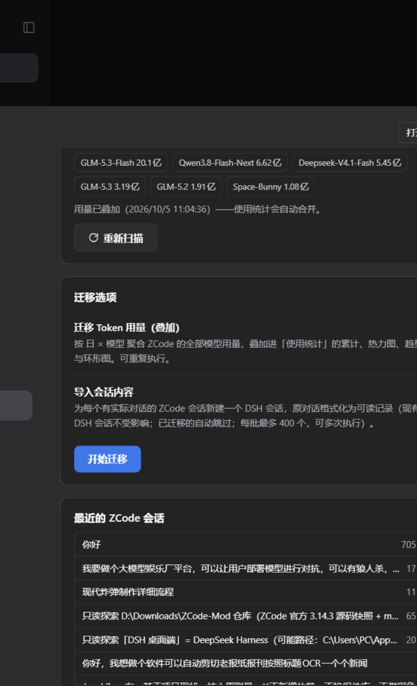

# dsh-session-migration — ZCode → DSH 会话迁移插件

把 ZCode 的会话与 Token 用量迁移到 DeepSeek Harness（DSH）：
**DSH 原有会话完全保留**，ZCode 会话以新会话形式只读导入，Token 用量按 日×模型 叠加进「使用统计」。



## 功能

- **扫描**：只读打开 `~/.zcode/cli/db/db.sqlite`（node:sqlite，WAL 并发安全），统计可迁移会话、消息数、Token 总量、模型分布、最近会话列表
- **Token 用量叠加**：`model_usage` 表按 本地日 × 模型 聚合（34k+ 条记录 / 41 亿+ tokens），写入 `~/.dsh/usage-stats/migrated-usage.json`；[dsh-usage-stats](https://github.com/One1turn/dsh-usage-stats) 的所有视图（累计/热力图/趋势/环形/连续天数）自动合并
- **会话导入**：为每个有实际对话的 ZCode 会话新建 DSH 会话（`ctx.sessions.create` + `sessionPersistence.create` 写句柄 + 整段对话格式化为可读转录 + session/title），原工作区 cwd 保留，DSH 侧栏直接可见
- **工作流子代理适配**：`workflow subagent actor#N@M` 这类内部子代理会话改题为「工作流名 · 角色名」（重名自动加 `#N`），并归入 DSH 归档区（`global.archivedSessionIds`），与真实对话会话区分
- **归档区分**：按 ZCode 库 `dwf_actor` 表识别子代理会话；归档会话在侧栏默认隐藏，搜索/视图选项可按归档过滤
- **幂等**：已迁移的 ZCode 会话记录在状态文件自动跳过；每批最多 400 个，可多次执行

## 安装

```powershell
git clone https://github.com/One1turn/dsh-session-migration.git
& "$env:LOCALAPPDATA\Programs\DeepSeek Harness\1\resources\runtime\cli\bin\dsh.cmd" plugin --profile desktop add -w link:<克隆路径>
```

装完重启 DSH，设置页出现「会话迁移」分区。

## 工作区归组

导入的会话统一挂到名为「ZCode 迁移」的独立工作区（目录 `~/.dsh/zcode-migrated`）。插件每次启动会把已迁移会话**直接并入 `~/.dsh/storages/workspace.json` 的工作区记录**（记录不存在则自动创建「ZCode 迁移」），无需手动添加；配合 [dsh-usage-stats](https://github.com/One1turn/dsh-usage-stats) 使用可获得叠加后的用量统计。

## 技术要点（踩坑记录）

- DSH 会话文件是**多帧 zstd 拼接**，`zstdDecompressSync` 只解第一帧，必须按帧魔数切片逐帧解压
- 插件自建的会话**不会自动持久化**：持久化后端只路由「有活跃写句柄」的会话，必须先 `ctx.sessionPersistence.create(header)` 打开写句柄再 `ctx.sessions.create(id, …)`，事件才会落盘
- v4 持久 user 消息要求 **producer-owned source kind**：`source: { kind: "user" }`（plugin kind 会被拒绝）
- v4 冷读要求 user/message 事件 **`data.id` 必须是非空字符串**（identified message）：实时 append 不校验，落盘后冷读校验，缺了整库判 corrupt、标题变「未命名」；assistant/developer 行的 id 在 `data.message.id`，**不要**再加顶层 `data.id`
- 会话归档走 `workspace.json` 的 `global.archivedSessionIds`（活会话用 `registry.archiveSession`）；但 `entity.attachSession` / `sessionQuery.readTitleSnapshots` 对无 agent 的冷会话会**永久挂起**——归档/挂接一律走注册表文件的离线合并 + 重启生效
- 一个会话 id 只能被一个工作区记录记账，重复会在宿主启动时抛 "workspace domain is inconsistent"，连带所有依赖插件激活失败
- 外部 link 插件解析不到宿主 asar 内 SDK：零 `@deepseek-ai/*` 裸导入，全部走 ctx 服务 + node 内置（node:sqlite 读 ZCode 库）

## 卸载

`dsh plugin --profile desktop remove @local/dsh-session-migration`；迁移产生的数据：`~/.dsh/session-migration/state.json`（幂等记录）与 `~/.dsh/usage-stats/migrated-usage.json`（叠加源，删除后使用统计恢复纯 DSH 数据）。
